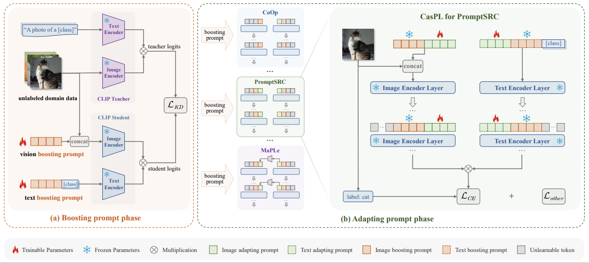

# Cascade Prompt Learning for Vision-Language Model Adaptation [ECCV 2024]


> [**Cascade Prompt Learning for Vision-Language Model Adaptation**]()<br>
> [Ge Wu*](https://github.com/Martinser), 
> [Xin Zhang*](https://github.com/zhasion), 
> [Zheng Li](https://zhengli97.github.io/), 
> [Zhaowei Chen](https://www.zhihu.com/people/chen-zhao-wei-16-2), 
> [Jiajun Liang](https://scholar.google.com/citations?user=xNxlvjEAAAAJ&hl=en), 
> [Jian Yang](https://scholar.google.com/citations?user=6CIDtZQAAAAJ&hl=en)
> [Xiang Li](https://scholar.google.com/citations?user=oamjJdYAAAAJ&hl=en)
*Joint first authors

[](https://arxiv.org/abs/2409.17805)
[]()


<hr />

## News
**(September 2024)** Training codes of CasPL+PromptSRC will be released.

**(July 2024)** Our work is accepted to ECCV 2024!  

  
<hr />

## Cascade Prompt Learning

### Highlights

1) **We propose a novel cascade prompt learning framework** consisting of both boosting and adapting prompt phases. To our best knowledge, CasPL is the first to introduce cascaded diverse prompts with multiple phases for VLMs, which is a brand new learning paradigm for fine-tuning VLMs.
2) We demonstrate that the **boosting prompts can distill domain-general knowledge** from the senior teacher over massive unlabeled domain images, leading to superior recognition performance and efficient inference.
3) **As a plug-and-play framework**, CasPL can be seamlessly integrated into **any existing prompt learning approaches**, with negligible parameters (boosting prompt tokens, <0.1\%) and ignorable additional inference cost introduced.


### Framework

<div style="text-align:center"></div>
<figcaption class="content has-text-left"  style="word-break:normal">Figure 1. An overview of CasPL framework. 
<strong>(a)</strong> We utilize a set of boosting prompts to enable the student CLIP model to extract general domain knowledge from the teacher CLIP model, leveraging an extensive amount of unlabeled domain data. 
<strong>(b)</strong> The boosting prompt can be seamlessly incorporated into existing related work as a plug-in. Here, we exemplify this integration with PromptSRC, where frozen boosting prompts are cascaded with learnable adapting prompts without altering any loss function. </figcaption>

### Results
#### Base-to-Novel: Results reported below show accuracy for base and novel classes for across 11 recognition datasets averaged over 3 seeds.
| Name    | Base Acc. | Novel Acc. |        HM         | 
|---------|:---------:|:----------:|:-----------------:|
| CLIP  |   69.34   |   74.22    |       71.70       |  
| CoOp |   82.69   |   63.22    |       71.66       | 
| CoOp+CasPL |   **84.78**   |   **74.49**    |   **79.30 (+7.64)**   | 
| CoCoOp |   80.47   |   71.69    |       75.83       | 
| CoCoOp+CasPL |   **83.63**   |   **78.12**    |   **80.78 (+4.95)**   |
| MaPLe |   82.28   |   75.14    |       78.55       |
| MaPLe+CasPL |   **84.48**   |   **79.59**    |   **81.96 (+3.41)**   |
| PromptSRC |   84.26   |   76.10    |       79.97       |  
| PromptSRC+CasPL |  **86.11**  | **79.54**  | **82.69 (+2.72)** |  

#### Few-shot: Results reported below show accuracy across 11 recognition datasets averaged over 3 seeds.
| Name      | 1 shot |  2 shot   |      4 shot       | 8 shot | 16 shot |
|-----------|:---------:|:---------:|:-----------------:|:-----------------: |:-------:|
| Linear probe CLIP |   45.83   |   57.98   |       68.01       |  74.47 |  78.79  |
| CoOp |   67.56   |   70.65   |        74.02       |76.98 |  79.89  |
| CoCoOp |   66.79   |   67.65   |        71.21       | 72.96 |  74.90  |
| MaPLe |   69.27   |   72.58   |       75.37       | 78.89 |  81.79  |
| PromptSRC |   72.32   |   75.29   |       78.35       |   80.69 |  82.87  |
| PromptSRC+CasPL |  **75.91**  | **77.94** | **80.45** |  **82.22** |  **84.49**  |


<hr />

## Running
### Installation 
For installation and other package requirements, please follow the instructions detailed in [INSTALL.md](docs/INSTALL.md). 

### Data Preparation
Please follow the instructions at [DATASETS.md](docs/DATASETS.md) to prepare all datasets.


### Training
#### (1) Base-to-Novel Experiments.
```
python train_script/caspl_promptsrc/train_base_to_new.py
```
train_base_to_new.py contains two-stage training, and the other experimental files also contain two-stage training:

```
bash scripts/ivlp/base2new_train_ivlp_teacher.sh #the first stage to get the boosting prompt
bash scripts/caspl/promptsrc/base2new_train_promptsrc_student.sh #the second stage to train the adapting prompt
```

#### (2) Few-shots Experiments.
```
python train_script/caspl_promptsrc/train_few_shot.py
```

#### (3) Cross-dataset Experiments.
```
python train_script/caspl_promptsrc/train_cross_dataset.py
```


<hr />

## Citation
If you find our work, this repository, or pretrained models useful, please consider giving a star and citation.


## Contact
If you have any questions, please create an issue on this repository or contact at gewu.nku@gmail.com.


## Acknowledgements

Our code is based on [PromptSRC](https://github.com/muzairkhattak/PromptSRC), along with [Co-CoOp and CoOp](https://github.com/KaiyangZhou/CoOp) repository. We thank the authors for releasing their code. If you use our model and code, please consider citing these works as well.

